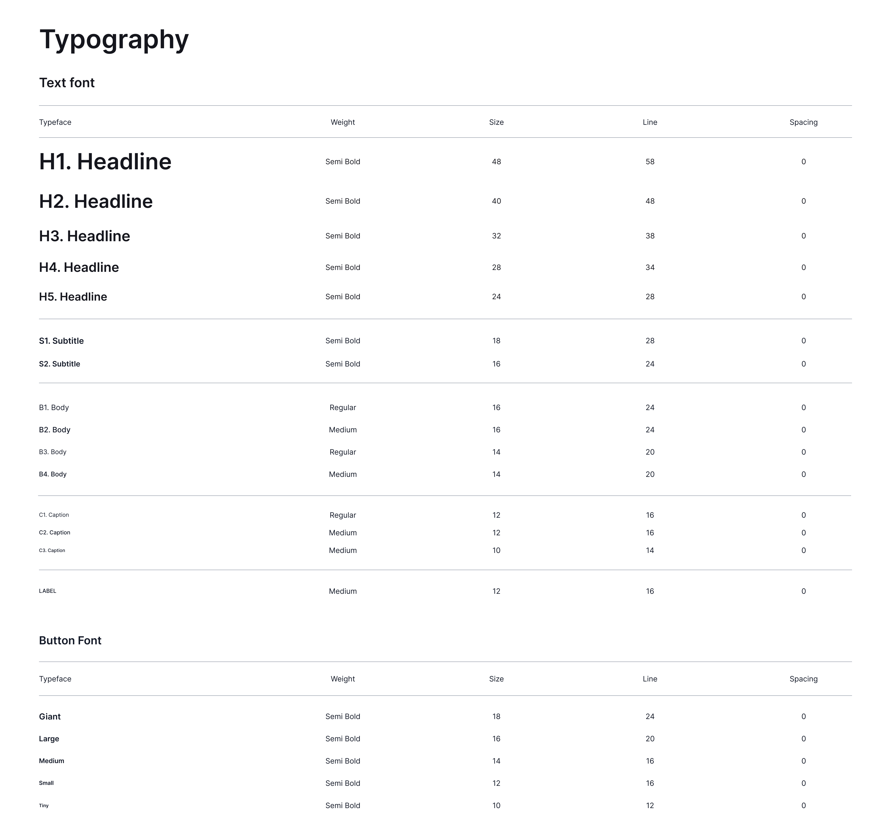
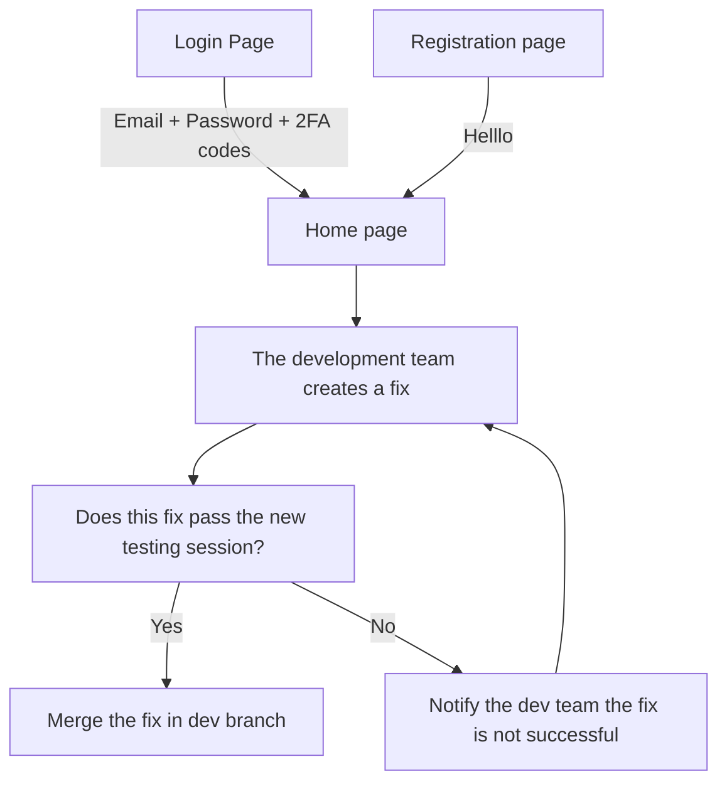

# Inkom - Functional Specification

Table of Contents

- [Inkom - Functional Specification](#inkom---functional-specification)
  - [1. Introduction](#1-introduction)
    - [1.1. Glossary](#11-glossary)
    - [1.2. Project Overview](#12-project-overview)
    - [1.3. Project Definition](#13-project-definition)
      - [1.3.1. Vision](#131-vision)
      - [1.3.2. Objectives](#132-objectives)
      - [1.3.3. Scope](#133-scope)
      - [1.3.4 Target Audience](#134-target-audience)
      - [1.3.5. Deliverables](#135-deliverables)
    - [1.4. Project Plan](#14-project-plan)
      - [1.4.1. Planning](#141-planning)
      - [1.4.2. Milestones](#142-milestones)
      - [1.4.3. Dependencies](#143-dependencies)
      - [1.4.4. Assumptions/Constraints](#144-assumptionsconstraints)
      - [1.4.5. Risks/Mitigation](#145-risksmitigation)
  - [2. Personas and Use Cases](#2-personas-and-use-cases)
    - [2.1. Personas](#21-personas)
      - [2.1.1. Persona 1 - William Anderson](#211-persona-1---william-anderson)
      - [2.1.2. Persona 2 - Emily Roberts](#212-persona-2---emily-roberts)
      - [2.1.3. Persona 3 - Jonathan Mitchell](#213-persona-3---jonathan-mitchell)
      - [2.1.4. Persona 4 - Sarah Thompson](#214-persona-4---sarah-thompson)
    - [2.2. Use Cases](#22-use-cases)
  - [3. Functional Requirements](#3-functional-requirements)
    - [3.1. Backend](#31-backend)
      - [3.1.1. Overview](#311-overview)
      - [3.1.2. API Linking](#312-api-linking)
      - [3.1.3. API Script Testing](#313-api-script-testing)
      - [3.1.4. Authentication](#314-authentication)
      - [3.1.5. Scheduled Content Upload](#315-scheduled-content-upload)
      - [3.1.6. Billing](#316-billing)
    - [3.2. Frontend](#32-frontend)
      - [3.2.1. Overview](#321-overview)
      - [3.2.2. Target Platforms](#322-target-platforms)
      - [3.2.3. Graphical Charter \& Assets](#323-graphical-charter--assets)
        - [3.2.3.1. Color Palette](#3231-color-palette)
        - [3.2.3.2. Font](#3232-font)
        - [3.2.3.3. Image Assets](#3233-image-assets)
        - [3.2.3.4. Icons Library](#3234-icons-library)
      - [3.2.4 Mockups](#324-mockups)
      - [3.2.5. All pages to add here](#325-all-pages-to-add-here)
      - [3.2.6. User Workflow](#326-user-workflow)
  - [3. Non-functional Requirements](#3-non-functional-requirements)
    - [3.1. Performance](#31-performance)
    - [3.2. Scalability](#32-scalability)
    - [3.3. Reliability](#33-reliability)
    - [3.4. Availability](#34-availability)

## 1. Introduction

### 1.1. Glossary

| Term | Definition |
| ---- | ---------- |
| SaaS |            |

### 1.2. Project Overview

This project aims to develop a cross-platform SaaS application designed to optimize entrepreneurs' return on investment in digital communication. It leverages Artificial Intelligence and social media data analysis to simplify the process while reducing entry barriers associated with technical expertise, financial or time constraints.

This project is the end-of-cursus project of [Antoine PREVOST](https://linkedin.com/in/antoine-prevost-dev), but also aims to create a company to sell this SaaS.

### 1.3. Project Definition

#### 1.3.1. Vision

Inkom empowers entrepreneurs to focus on their core business by streamlining and automating communication workflows. It creates opportunities for those lacking expertise or resources to communicate effectively, offering a comprehensive suite of tools to help them communicate with confidence.

Inkom transforms the communication value chain by supporting entrepreneurs at every stage of their communication processes, including the following:

- Defining a Communication Strategy
- Linking Social Network Platforms
- Generating Content Ideas
- Publishing Content Centrally
- Analyzing Content Centrally
- Tailoring Strategies Based on Analytics
- Encouraging Interactions

The vision of Inkom is to bring actionnable and concrete facts users can leverage to make their communication more impactful whie spending less time on creating content.

#### 1.3.2. Objectives

- **Content Management Hub:** A centralized platform for managing all content creation and publication needs.
- **Actionable Content Insights:** Provides clear guidelines to enhance content engagement and value.
- **Cross-Platform Support:** A SaaS solution available as both a web application and a lightweight mobile app, ensuring accessibility across devices.

#### 1.3.3. Scope

The scope of the Inkom project is to develop a SaaS communication platform that streamlines and automates communication workflows for entrepreneurs. It empowers users to efficiently manage their social media presence with an intuitive interface and advanced tools, regardless of their expertise or resources.

#### 1.3.4 Target Audience

- **Entrepreneurs:** Empower individuals to focus on their core business by automating communication tasks, providing an intuitive platform to create, publish, and analyze content effortlessly, even without prior expertise.

- **Small-to-Medium Businesses:** Enhance team efficiency and scalability with centralized social media management, enabling streamlined workflows, consistent branding, and data-driven strategies tailored to business growth.

- **Consultants:** Offer a professional-grade tool to optimize client services by simplifying social media integrations, generating tailored content ideas, and delivering insightful analytics to demonstrate measurable results.

#### 1.3.5. Deliverables

<!-- Add onk to the website when available -->

The primary deliverable of this project is the final application, which will be made publicly available on app stores and for direct download via [our website](#).

To ensure consistency throughout the development process and document all features, the following additional deliverables will be produced:  

| Deliverable                                    | Purpose                                                                        |
| ---------------------------------------------- | ------------------------------------------------------------------------------ |
| Functional Specification Document              | Defines the application's functionality and requirements.                      |
| Technical Specification Document               | Details the technical architecture and implementation.                         |
| Test Plan & Test Cases                         | Outlines the testing strategy and specific tests for validating functionality. |
| Test Bed                                       | A controlled environment to execute and evaluate the application.              |
| Mock-Ups                                       | Visual prototypes of the application interface.                                |
| Source Code and AI Model                       | Includes the AI model for content strategies and the complete source code.     |
| Source Code for Website and Mobile Application | Codebase for the platform's web and mobile components.                         |
| User Manual                                    | Comprehensive documentation for end-users.                                     |
| Final Project Presentation                     | Summarizes the project's outcomes and achievements.                            |

Additionally, progress presentations will be conducted throughout the course to review project milestones and support the graduation process of [Antoine Prevost](https://github.com/TechXplorerFR).  

### 1.4. Project Plan

#### 1.4.1. Planning

The [Gantt Chart](https://docs.google.com/spreadsheets/d/1rNRcJh22dUDlhf4dmPxH1mff9Aw21R4dun3HtO3kdFY/edit?usp=sharing) provides the evolving project timeline and planning details.

#### 1.4.2. Milestones

| Date       | Milestone                                            |
| ---------- | ---------------------------------------------------- |
| 08/01/2024 | Project Kick-Off                                     |
| 10/31/2024 | Proof of Concept (PoC) / Feasibility Check           |
| 11/30/2024 | Completion of Market Analysis                        |
| 02/28/2025 | Beta Testing Phase Kick-Off (Minimum Viable Product) |
| 05/01/2025 | Release 1                                            |
| TBD        | Release 2                                            |

#### 1.4.3. Dependencies

- Minimum Viable Product development cannot start before the Proof of Concept and market analysis have not been completed.
- Beta Testing cannot start before Minimum Viable Product has not been completed.
- Apart from fixes, development on new features for Relases cannot start before feedback has been gathered on the current version.

#### 1.4.4. Assumptions/Constraints

**Assumptions:**

| Assumption                      | Description                                                                                                                              |
| ------------------------------- | ---------------------------------------------------------------------------------------------------------------------------------------- |
| Basic User Knowledge            | Users have basic familiarity with social media platforms and content workflows.                                                          |
| Data Privacy Trust              | Users trust the platform to handle their data securely and only with their explicit consent.                                             |
| Reliable Internet Access        | Users have stable internet connectivity, required for social media API interactions and platform functionality.                          |
| Existing Social Media Accounts  | Users possess active social media accounts they plan to integrate with the platform.                                                     |
| User Responsibility for Content | Users are accountable for reviewing and approving all content before it is published.                                                    |
| API Reliability                 | Social media platform APIs are assumed to remain functional and relatively stable during development and MVP launch.                     |
| Device Compatibility            | Users access the platform via devices meeting minimum hardware and software requirements (e.g., supported browsers, mobile OS versions). |
| Legal Compliance                | Users adhere to relevant legal requirements, such as data protection and copyright laws, while using the platform.                       |
| Third-Party Service Continuity  | Social media services and APIs will not undergo major changes that disrupt functionality during the MVP phase.                           |
| Scalability Readiness           | The platform infrastructure can accommodate expected user volume and interactions without significant performance degradation.           |

**Constraints:**

| Constraint               | Description                                                                                                                                           |
| ------------------------ | ----------------------------------------------------------------------------------------------------------------------------------------------------- |
| Authentication           | Two-factor authentication (2FA) is mandatory to ensure secure integration of all linked platforms.                                                    |
| Platform Compatibility   | The application must be compatible with iOS, Android, Windows, Linux, MacOS, and the web.                                                             |
| Security                 | Robust measures are required to prevent data breaches that could compromise users' social media accounts.                                             |
| API Rate Limits          | Social media platform interactions must operate within their defined API rate limits, affecting posting and analytics retrieval frequency.            |
| Data Privacy Regulations | The application must comply with data privacy laws such as GDPR and CCPA, especially for users in affected regions.                                   |
| Latency                  | The system must provide low-latency performance for actions like retrieving analytics and generating AI content to ensure a seamless user experience. |
| Cost Constraints         | Cloud infrastructure and AI processing costs must be optimized to support a sustainable business model.                                               |

#### 1.4.5. Risks/Mitigation

| ID  | Description                                                                  | Consequence                                            | Impact | Likelihood | Mitigation/Avoidance                                                 |
| --- | ---------------------------------------------------------------------------- | ------------------------------------------------------ | ------ | ---------- | -------------------------------------------------------------------- |
| 1   | A similar solution is released                                               | Check for any possible infringed patent                | High   | Medium     | Monitor technology development in communication field                |
| 2   | Used social media platforms evolved                                          | Add a support for newly popular social media platforms | Medium | Medium     | Monitor trending social media platforms usage (mainly for consumers) |
| 3   | New features are released on existing social media platforms                 | Add a support for the newly added features             | Medium | High       | Monitor new features added to social media platforms                 |
| 4   | End of support / breaking changes of APIs for certain social media platforms | Switch to the newest API version or find alternatives  | High   | Low        | Monitor and anticipate API version switching                         |

## 2. Personas and Use Cases

### 2.1. Personas

#### 2.1.1. Persona 1 - William Anderson

Age: 53
Location: Paris, Île-de-France
Profession: Restaurateur

**Goals:**

- Make his posts more engaging to convince people following him on the social networks to come to his restaurant.
- Keep his followers updated of the latest courses he prepares.

**Frustrations:**

- He has a limited knowledge about social networks management.
- He wants to get engaging post propositions linked to his business.

#### 2.1.2. Persona 2 - Emily Roberts

Age: 32
Location: Compiègne, Hauts-de-France
Profession: Shoe store owner

**Goals:**

- Keep her followers updated about her stores new products and discounts.
- Make people discover her store on multiple platforms.

**Frustrations:**

- She only knows how to efficiently target her users on a single platform, and is consequently posting on this sole one.
- She has a lot of struggles finding innovative ideas for her business.

#### 2.1.3. Persona 3 - Jonathan Mitchell

Age: 32
Location: Berlin, Germany
Profession: Freelance in design

**Goals:**

- Create posts reaching a wider audience to promote his services.
- Plan in advance his content publication on multiple social media platforms.

**Frustrations:**

- He needs to post his content on each platform individually, making him lose a lot of time.
- He feels only a few people can identify to his publications.
- He doesn't understand anything about the analytics provided in the platforms and has difficulty having an overview of them.

#### 2.1.4. Persona 4 - Sarah Thompson

Age: 23
Location: San Francisco, California
Profession: Software Engineer & Collective Director

**Goals:**

- Initiate people about software development and break the existing clichés.
- Inspire people to start their software development journey.

**Frustrations:**

- She has struggles to find ideas to post on a daily basis.
- She wants a defined strategy she can easily refine depending on the performance of her posts and current trends.

### 2.2. Use Cases

| Use Case                         | Description                                                                                                                                                  |
| -------------------------------- | ------------------------------------------------------------------------------------------------------------------------------------------------------------ |
| Social Media Content Scheduling  | A user schedules posts across multiple platforms, specifying dates and times. The system auto-generates optimized posting schedules based on analytics data. |
| Analytics Retrieval              | A user retrieves engagement analytics for posts across different platforms. The application consolidates the data into a unified view for easy comparison.   |
| AI-Powered Content Creation      | A user inputs keywords or themes, and the platform generates draft posts or video scripts tailored to their audience.                                        |
| Social Media Account Integration | A user links their social media accounts to the platform, enabling unified management and analytics.                                                         |
| Collaborative Editing            | Multiple users collaborate on creating, editing, and approving posts before publishing. The platform tracks changes and approval statuses.                   |
| User Notifications               | The system notifies users of key events, such as scheduled posts going live, upcoming deadlines, or analytics insights that require attention.               |
| GDPR Compliance Management       | Users configure their accounts to ensure compliance with regional data privacy laws, including opt-in consent settings for their audience.                   |
| Real-Time Feedback               | The platform provides real-time feedback on post quality, recommending changes to improve engagement potential before publishing.                            |

## 3. Functional Requirements

### 3.1. Backend

#### 3.1.1. Overview

The backend of Inkom is the core component of the application, designed to centralize and streamline complex social media tasks.

#### 3.1.2. API Linking

To provide a proof of concept in the Minimum Viable Product (MVP), the application initially supports a limited number of social media platforms:

- **YouTube**: Video publishing and analytics.  
- **TikTok**: Short-form video sharing and performance tracking.  
- **Instagram**: Post scheduling, story analytics, and reel uploads.  
- **LinkedIn**: Professional content sharing and engagement tracking.  
- **Twitter**: Real-time tweet scheduling and analytics.  
- **Facebook**: Page and group post management.

As Inkom evolves, this list will expand, enabling broader compatibility with other platforms.

---

#### 3.1.3. API Script Testing

To ensure uninterrupted service, external monitoring scripts will track all interactions with social media APIs. This process minimizes downtime and ensures reliability. These scripts check:

- **Content Publishing**: Verifies successful posts across platforms.  
- **Analytics Retrieval**: Ensures accuracy and timeliness of performance data.  
- **Comments Retrieval**: Captures feedback for users to engage with their audience.  
- **Content Retrieval for AI Analysis**: Prepares content for future AI-driven insights.  

By continuously testing these critical components, we aim to maintain a high-quality user experience.

---

#### 3.1.4. Authentication

Given Inkom's role as a centralized hub for managing multiple social media accounts, user security is paramount. 

**Mandatory Security Measures**  
- Users must provide a recovery email or phone number for account retrieval.  
- Two-factor authentication (2FA) is required, using an app such as Google Authenticator.  

**Optional Advanced Security Features**  
- Users can enable a **24-word private key** to sign in, with prompts to input parts of it during login.  
- Desktop users can opt for a **physical security key** (e.g., USB token) for additional protection.

These measures are designed to safeguard accounts from unauthorized access and maintain user trust.

---

#### 3.1.5. Scheduled Content Upload

Inkom will leverage cloud storage and server optimization to ensure scalable, reliable content scheduling. Key features include:

- **Load Balancing**: Scripts distribute server load to optimize performance, moving resources between cold (long-term, less accessible) and active (frequently accessed) storage.  
- **Scheduled Publishing**: Users can schedule posts to go live at specific times, ensuring consistent social media activity without manual intervention.

This approach guarantees efficient resource usage and scalability as Inkom grows.

---

#### 3.1.6. Billing

To support seamless subscription management, Inkom will integrate payment processing via Stripe. This will enable:

- **Flexible Payment Plans**: Users can choose from various subscription tiers to fit their needs.  
- **Automatic Invoicing**: Simplified record-keeping for users with automated billing and receipts.  
- **Secure Transactions**: Stripe ensures high levels of payment security, meeting industry standards.

With these systems, users can easily manage their subscriptions and payments.

### 3.2. Frontend

#### 3.2.1. Overview

The frontend of Inkom serves as the user-facing interface, ensuring an intuitive and seamless experience across all supported devices. It is designed to provide the following key functionalities:

- **Unified Dashboard**  
  - A central hub for managing all connected social media accounts, displaying essential metrics, scheduled posts, and recent activity at a glance.

- **Content Creation and Scheduling**  
  - User-friendly tools for drafting, editing, and scheduling posts across multiple platforms with real-time previews for each platform's format.

- **Analytics Visualization**  
  - Interactive charts and graphs to display performance metrics, trends, and engagement statistics in an easily digestible format.

- **Account Management**  
  - Intuitive settings for linking social media accounts, updating user profiles, and managing subscription plans.

- **Cross-Platform Compatibility**  
  - A responsive web application designed for use on desktops, tablets, and smartphones, ensuring consistency regardless of device.

This frontend architecture prioritizes accessibility, usability, and scalability, delivering a seamless experience for users managing their social media presence.

#### 3.2.2. Target Platforms

- **Web Application:** Compatible with modern browsers like Chrome, Firefox, Safari, and Edge.
- **Desktop Applications:** Dedicated apps for MacOS and Windows, with support for physical security keys.
- **Mobile Applications:** Native apps for iOS and Android, built with React Native for optimized performance and consistent functionality.

#### 3.2.3. Graphical Charter & Assets

##### 3.2.3.1. Color Palette

| Color Name                | Hexadecimal Code | Color Preview                                                | Usage                          | Description                          |
| ------------------------- | ---------------- | ------------------------------------------------------------ | ------------------------------ | ------------------------------------ |
| Deep Blue (Primary Color) | #2E6BF5          |  | Main elements                  | Buttons, links, and key UI elements. |
| Black (Secondary Color)   | #000000          |  | Text and essential highlights  | Used for headings and body text.     |
| Light Gray                | #F9FAFB          |  | Background Color (White theme) | Subtle background for contrast.      |

##### 3.2.3.2. Font

The primary font used is ***Inter*** with the following specifications:  

##### 3.2.3.3. Image Assets

The assets directory contains all visual elements used in the application, such as logos, illustrations, and background images. This ensures consistency across the app's design. 

<!-- ⚠️ To add -->

##### 3.2.3.4. Icons Library

The project uses ***Iconoir*** for its modern and lightweight icon set, offering over 1,000 customizable icons that align with the app's graphical charter.

#### 3.2.4 Mockups

The app mockups can be accessed [here](https://www.figma.com/design/DByZwH8OgEuzHOefwmxteJ/InKom?node-id=22-4&t=GPUplvLvprAhO1Ha-1).

#### 3.2.5. All pages to add here

#### 3.2.6. User Workflow

<!-- ### 3.3. Artificial Intelligence Model

#### 3.3.1. Overview

#### 3.3.2. Dataset

#### 3.3.3. Input

#### 3.3.4. Output -->

## 3. Non-functional Requirements

### 3.1. Performance

| Aspect                      | Requirement                                                              |
| --------------------------- | ------------------------------------------------------------------------ |
| **Response Time**           | API requests (e.g., publishing, analytics retrieval) within 1–2 seconds. |
| **Frontend Responsiveness** | Smooth interface operation under normal and peak load conditions.        |
| **File Uploads**            | Support for large files (up to 1 GB) with minimal delay.                 |
| **Background Tasks**        | Scheduled tasks must execute within allocated time slots.                |

---

### 3.2. Scalability

- **Backend**: Supports horizontal scaling to handle increased traffic by adding servers.  
- **Cloud Storage**: Dynamically adjusts to accommodate larger files and growing media assets.  
- **APIs**: Processes thousands of concurrent requests without performance degradation.  

---

### 3.3. Reliability

| Aspect               | Requirement                                                                    |
| -------------------- | ------------------------------------------------------------------------------ |
| **API Interactions** | Implement error detection and automated retries.                               |
| **Processes**        | Ensure consistent execution of uploads, scheduling, and analytics retrieval.   |
| **Testing**          | Regular automated testing for critical components to prevent bugs or downtime. |

---

### 3.4. Availability

| Aspect                | Requirement                                                                             |
| --------------------- | --------------------------------------------------------------------------------------- |
| **Uptime**            | Guarantee 99.9% uptime.                                                                 |
| **Redundancy**        | Implement failover servers and load balancers for continuity during failures.           |
| **Maintenance**       | Minimize scheduled maintenance periods and provide advance communication.               |
| **Critical Services** | Keep key functions (authentication, content publishing) operational during maintenance. |
