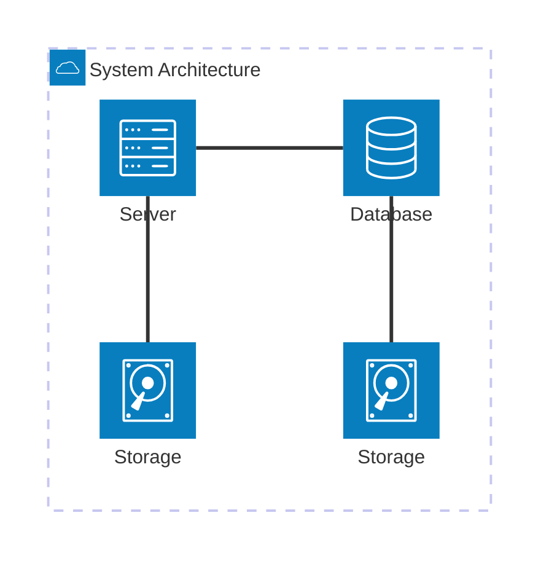

# Inkom - Technical Specification

Table of Contents

- [Inkom - Technical Specification](#inkom---technical-specification)
  - [1. Overview](#1-overview)
    - [1.1. Purpose](#11-purpose)
    - [1.2. System Context](#12-system-context)
  - [2. Architecture](#2-architecture)
    - [2.1. System Architecture Diagram](#21-system-architecture-diagram)
    - [2.2. Backend Architecture](#22-backend-architecture)
    - [2.3. Frontend Architecture](#23-frontend-architecture)
    - [2.4. Database Architecture](#24-database-architecture)
  - [3. Detailed Components](#3-detailed-components)
    - [3.1. Backend Components](#31-backend-components)
      - [3.1.1. API Gateway](#311-api-gateway)
      - [3.1.2. Authentication and Authorization](#312-authentication-and-authorization)
      - [3.1.3. Social Media API Integration](#313-social-media-api-integration)
      - [3.1.4. Content Scheduling and Publishing](#314-content-scheduling-and-publishing)
      - [3.1.5. Analytics Processing](#315-analytics-processing)
      - [3.1.6. Billing Services](#316-billing-services)
    - [3.2. Frontend Components](#32-frontend-components)
      - [3.2.1. Web Application](#321-web-application)
      - [3.2.2. Mobile Application](#322-mobile-application)
      - [3.2.3. UI/UX Design System](#323-uiux-design-system)
    - [3.3. Database Design](#33-database-design)
      - [3.3.1. Schema Overview](#331-schema-overview)
      - [3.3.2. Key Tables and Relationships](#332-key-tables-and-relationships)
      - [3.4.2. Dataset Requirements](#342-dataset-requirements)
      - [3.4.3. Input and Output Formats](#343-input-and-output-formats)
  - [4. System Requirements](#4-system-requirements)
    - [4.1. Performance Requirements](#41-performance-requirements)
    - [4.2. Scalability Requirements](#42-scalability-requirements)
    - [4.3. Security Requirements](#43-security-requirements)
    - [4.4. Availability Requirements](#44-availability-requirements)
  - [5. Risks and Mitigation](#5-risks-and-mitigation)
  - [6. Implementation Plan](#6-implementation-plan)
    - [6.1. Milestones and Timeline](#61-milestones-and-timeline)
    - [6.2. Technology Stack](#62-technology-stack)
    - [6.3. Testing Plan](#63-testing-plan)

## 1. Overview

### 1.1. Purpose

The purpose of this technical specification document is to outline the technical implementation of **Inkom**, a centralized SaaS communication platform. It includes the system architecture, key components, and implementation details to ensure successful development and deployment.

### 1.2. System Context

A centralized platform integrating with multiple social media APIs to provide unified content creation, publishing, analytics, and management for entrepreneurs, businesses, and consultants.

## 2. Architecture

### 2.1. System Architecture Diagram

Inkom System is composed of interactions between the following components:

| Component                                      | Description                                     | Technology                 |
| ---------------------------------------------- | ----------------------------------------------- | -------------------------- |
| Website/Mobile Application/Desktop Application | User interfaces for intercating with the system | Tauri + Vite + TailwindCSS |
| 

Include a diagram outlining the relationship between the **frontend**, **backend**, **database**, **third-party services (e.g., APIs, Stripe)**, and **cloud infrastructure**.

### 2.2. Backend Architecture

### 2.3. Frontend Architecture

### 2.4. Database Architecture

## 3. Detailed Components

### 3.1. Backend Components

#### 3.1.1. API Gateway

#### 3.1.2. Authentication and Authorization

#### 3.1.3. Social Media API Integration

#### 3.1.4. Content Scheduling and Publishing

#### 3.1.5. Analytics Processing

#### 3.1.6. Billing Services

### 3.2. Frontend Components

#### 3.2.1. Web Application

#### 3.2.2. Mobile Application

#### 3.2.3. UI/UX Design System

### 3.3. Database Design

#### 3.3.1. Schema Overview

#### 3.3.2. Key Tables and Relationships

#### 3.4.2. Dataset Requirements

#### 3.4.3. Input and Output Formats

## 4. System Requirements

### 4.1. Performance Requirements

### 4.2. Scalability Requirements

### 4.3. Security Requirements

### 4.4. Availability Requirements

## 5. Risks and Mitigation

## 6. Implementation Plan

### 6.1. Milestones and Timeline

### 6.2. Technology Stack

### 6.3. Testing Plan

<!-- Described later in the test plan, links to redirect to it-->